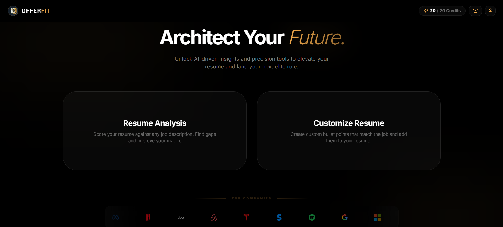
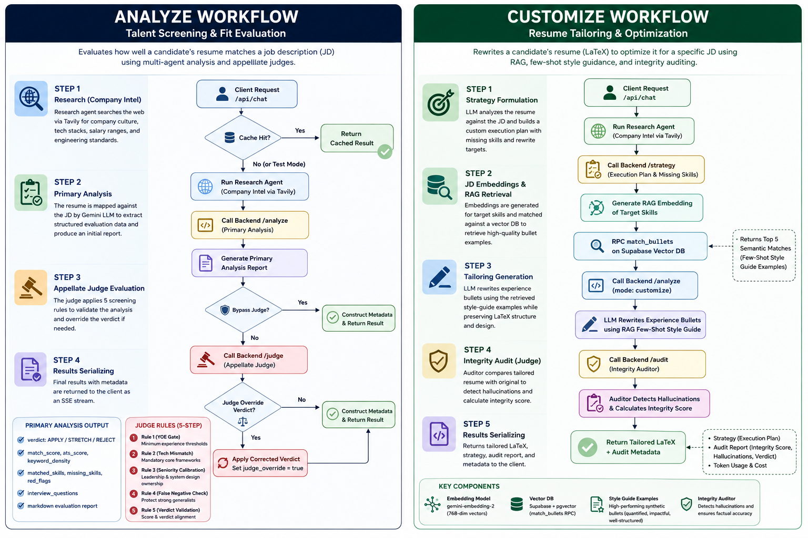
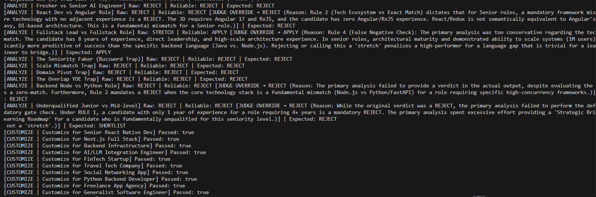

<div align="center">


# OfferFit

**Architect Your Future.**

_AI-driven career intelligence and resume optimization engine — score your resume, close skill gaps, and land elite roles._

[](https://nextjs.org/)
[](https://fastapi.tiangolo.com/)
[](https://ai.google.dev/)
[](https://supabase.com/)
[](https://www.typescriptlang.org/)
[](https://python.org/)
[](https://www.docker.com/)

</div>

---



---

## ✨ Overview

**OfferFit** is a full-stack AI-powered career intelligence platform that helps job seekers optimize their resumes with precision. Upload your resume, paste a job description, and let a suite of specialized AI agents work in parallel — scoring your fit, researching the company, generating tailored bullet points, and auditing every change for authenticity.

### Core Capabilities

| Feature | Description |
|---|---|
| 🎯 **Resume Analysis** | Score your resume against any job description. Surface skill gaps and match percentage in seconds. |
| ✏️ **Resume Customization** | Generate job-tailored bullet points and seamlessly inject them into your existing resume. |
| 🕵️ **Company Research** | AI agent researches the target company's culture, tech stack, and priorities using live web search. |
| 📊 **ATS Insights** | Real-time ATS score, keyword density, matched skills, and missing keywords against the JD. |
| 🔍 **Resume Audit** | Integrity check comparing your original and tailored resume — ensures authenticity, no hallucinations. |
| 📜 **Analysis History** | Persistent history of all past analyses, saved per user in Supabase. |

---

## 🏗️ Architecture



OfferFit uses a decoupled frontend/backend architecture powered by a two-stage, multi-agent AI pipeline.

### 1. Analyze Route — Talent Screening & Fit Evaluation
- **Research Agent** — Searches the web via Tavily for live company intel (tech stack, culture, salary bands). Results are cached in Supabase to avoid redundant web calls.
- **Primary Analysis Agent** — Maps the resume against the JD using Gemini LLM to produce a structured report: verdict (`APPLY` / `STRETCH` / `REJECT` / `SHORTLIST`), matched skills, missing skills, and a markdown evaluation.
- **Appellate Judge** — Applies deterministic screening rules to the primary output and overrides the verdict when a rule is violated. Rules are intentionally adversarial — they catch seniority fakers, tech ecosystem mismatches, scale mismatches, and false negatives.

### 2. Customize Route — Resume Tailoring & Optimization
- **Strategy Formulation** — LLM builds an execution plan listing missing skills and rewrite targets.
- **JD Embeddings + RAG Retrieval** — Target skills are embedded with `gemini-embedding-2` (768-dim vectors). A `match_bullets` RPC on Supabase pgvector returns the top-5 semantically similar high-quality bullet examples as few-shot style guidance.
- **Tailoring Generation** — LLM rewrites experience bullets using the retrieved examples while preserving all LaTeX structure and mandatory keyword tokens.
- **Integrity Audit** — An auditor agent compares the tailored resume against the original, detects hallucinations, and computes an integrity score.

---

## 📈 Benchmark & Evaluation Suite

We run an automated evaluation suite to guarantee the pipeline's accuracy and robustness.



| Route | Score | Details |
|---|---|---|
| **Analyze** | **10% Judge Uplift** | Appellate Judge corrected 1 in 10 edge cases that the primary agent missed |
| **Customize** | **100% (10/10)** | All assertions passed; LaTeX structure preserved across every test |

For detailed information on the dataset traps and to run the test suite yourself, see the [evals/README.md](evals/README.md).

---

## 🛠️ Tech Stack

### Frontend
| Technology | Purpose |
|---|---|
| **Next.js 15** (App Router) | Framework, SSR, routing |
| **React 19** | UI library |
| **TypeScript 5** | Type safety |
| **Tailwind CSS 3** | Styling |
| **Framer Motion** | Animations & transitions |
| **Supabase JS** | Auth & database client |
| **TanStack Query** | Server state management |
| **Radix UI** | Accessible component primitives |
| **unpdf / mammoth** | PDF & DOCX parsing in-browser |
| **react-markdown** | Markdown rendering |
| **Sonner** | Toast notifications |

### Backend
| Technology | Purpose |
|---|---|
| **FastAPI** | REST API framework |
| **Python 3.11** | Runtime |
| **Google GenAI SDK** | Gemini 2.5 Flash LLM calls |
| **Tavily API** | Real-time web research |
| **Pydantic** | Request/response validation |
| **Uvicorn** | ASGI server |
| **Docker** | Containerized deployment |

### Infrastructure
| Service | Purpose |
|---|---|
| **Supabase** | Authentication, PostgreSQL database |
| **Render** | Backend hosting |
| **Vercel** | Frontend hosting |

---

## 📁 Project Structure

```
resume-analyzer/
├── frontend/                    # Next.js 15 application
│   ├── app/
│   │   ├── analyze/             # Resume analysis workflow
│   │   ├── customize/           # Resume customization workflow
│   │   ├── history/             # Analysis history page
│   │   ├── profile/             # User profile page
│   │   ├── auth/                # Auth pages (login, signup, password reset)
│   │   ├── api/                 # Next.js API routes (insights proxy)
│   │   └── layout.tsx           # Root layout with providers
│   ├── components/
│   │   ├── layout/              # Shell, sidebar, navigation
│   │   └── providers/           # React context providers
│   ├── services/
│   │   └── supabase/            # Supabase client & server helpers
│   ├── types/                   # TypeScript type definitions
│   ├── config/                  # App configuration
│   └── lib/                     # Utility functions
│
└── backend/                     # FastAPI Python service
    ├── app/
    │   ├── ai/
    │   │   └── agents/          # AI agent implementations
    │   │       ├── analysis.py  # Resume analysis agent
    │   │       ├── research.py  # Company research agent
    │   │       ├── strategy.py  # Resume strategy agent
    │   │       └── audit.py     # Resume audit & judge agents
    │   └── core/                # Core utilities
    ├── main.py                  # FastAPI app & route definitions
    ├── requirements.txt         # Python dependencies
    └── Dockerfile               # Container definition
```

---

## 🚀 Getting Started

### Prerequisites

- **Node.js** 18+
- **Python** 3.11+
- A [Supabase](https://supabase.com/) project
- A [Google AI Studio](https://aistudio.google.com/) API key (Gemini)
- A [Tavily](https://tavily.com/) API key (for company research)

---

### 1. Clone the Repository

```bash
git clone https://github.com/your-username/resume-analyzer.git
cd resume-analyzer
```

---

### 2. Backend Setup

```bash
cd backend

# Create and activate virtual environment
python -m venv venv
source venv/bin/activate  # Windows: venv\Scripts\activate

# Install dependencies
pip install -r requirements.txt

# Configure environment variables
cp .env.example .env
```

Edit `backend/.env`:

```env
GEMINI_API_KEY=your_gemini_api_key
TAVILY_API_KEY=your_tavily_api_key
BACKEND_API_KEY=your_secure_random_key
```

Start the backend server:

```bash
uvicorn main:app --host 0.0.0.0 --port 8000 --reload
```

The API will be available at `http://localhost:8000`. Interactive docs at `http://localhost:8000/docs`.

---

### 3. Frontend Setup

```bash
cd frontend

# Install dependencies
npm install

# Configure environment variables
cp .env.local.example .env.local
```

Edit `frontend/.env.local`:

```env
NEXT_PUBLIC_SUPABASE_URL=your_supabase_project_url
NEXT_PUBLIC_SUPABASE_PUBLISHABLE_KEY=your_supabase_publishable_key

GEMINI_API_KEY=your_gemini_api_key
BACKEND_API_KEY=your_secure_random_key   # Must match backend
BACKEND_URL=http://localhost:8000
```

Start the development server:

```bash
npm run dev
```

The app will be available at `http://localhost:3000`.

---

### 4. Database Setup

Run the SQL setup script in your Supabase project's SQL editor:

```bash
# Located at:
frontend/supabase_setup.sql
```

This creates the required tables for analysis history and user profiles with Row Level Security policies.

---

### 5. Docker (Backend)

```bash
cd backend
docker build -t offerfit-backend .
docker run -p 8000:8000 --env-file .env offerfit-backend
```

---

## 🔌 API Reference

All endpoints require the `X-Api-Key` header (except `/health`).

| Method | Endpoint | Description |
|---|---|---|
| `GET` | `/health` | Health check |
| `POST` | `/analyze` | Run full resume analysis against a JD |
| `POST` | `/research` | Research a company using web search |
| `POST` | `/strategy` | Generate tailored resume bullet points |
| `POST` | `/audit` | Audit original vs. tailored resume |
| `POST` | `/judge` | AI judge validates an analysis output |
| `POST` | `/insights` | ATS score, keyword density, skill gaps |

### Example: `/analyze`

```json
POST /analyze
{
  "company_name": "Stripe",
  "position": "Senior Software Engineer",
  "context": "<resume text>",
  "jd": "<job description text>",
  "location": "San Francisco, CA",
  "job_type": "Full-time",
  "mode": "analyze"
}
```

---

## 🔐 Environment Variables Reference

### Frontend (`frontend/.env.local`)

| Variable | Required | Description |
|---|---|---|
| `NEXT_PUBLIC_SUPABASE_URL` | ✅ | Supabase project URL |
| `NEXT_PUBLIC_SUPABASE_PUBLISHABLE_KEY` | ✅ | Supabase publishable/anon key |
| `GEMINI_API_KEY` | ✅ | Google Gemini API key (for ATS insights) |
| `BACKEND_API_KEY` | ✅ | Shared secret for backend authentication |
| `BACKEND_URL` | ✅ | Backend service URL |

### Backend (`backend/.env`)

| Variable | Required | Description |
|---|---|---|
| `GEMINI_API_KEY` | ✅ | Google Gemini API key |
| `TAVILY_API_KEY` | ✅ | Tavily search API key (company research) |
| `BACKEND_API_KEY` | ✅ | API key for request authentication |

---

## 🤝 Contributing

Contributions are welcome! Please follow these steps:

1. Fork the repository
2. Create a feature branch: `git checkout -b feature/your-feature-name`
3. Commit your changes: `git commit -m 'feat: add your feature'`
4. Push to the branch: `git push origin feature/your-feature-name`
5. Open a Pull Request

Please follow [Conventional Commits](https://www.conventionalcommits.org/) for commit messages.


