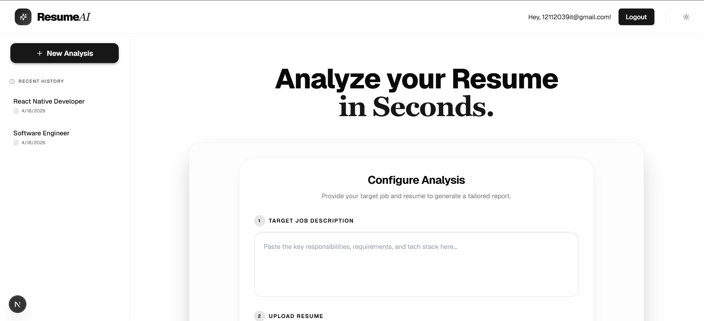

# ⚡ ResumeAI Analyzer

**ResumeAI Analyzer** is a professional-grade AI platform designed to help job seekers optimize their resumes for specific job descriptions. Using a high-speed intelligence engine, it performs deep-gap analysis, generates actionable insights, and provides a polished history dashboard for tracking progress.



## ✨ Features

- **🎯 AI Diagnostic Engine**: Leverages `Gemini 2.0 Flash Lite` for instantaneous, high-fidelity resume-to-JD comparisons.
- **📊 Match Scoring**: Precise percentage match scores based on technology, experience, and soft skill alignment.
- **🛡️ Secure History**: Persistent analysis storage via Supabase with Row Level Security (RLS) to ensure your data is yours alone.
- **📄 Pro PDF Export**: Export your diagnostic reports as beautifully formatted, professional PDF documents.
- **🧩 Modern UI/UX**: A state-of-the-art glassmorphic dashboard built with Tailwind CSS, featuring smooth micro-animations and a unified design system.

## 🛠️ Tech Stack

- **Framework**: [Next.js 15 (App Router)](https://nextjs.org/)
- **Database / Auth**: [Supabase](https://supabase.com/)
- **AI Model**: [Google Gemini Pro / Flash](https://aistudio.google.com/)
- **Styling**: [Tailwind CSS](https://tailwindcss.com/) + [Radix UI](https://www.radix-ui.com/)
- **Icons**: [Lucide React](https://lucide.dev/)
- **Document Engine**: [jsPDF](https://rawgit.com/MrRio/jsPDF/master/docs/index.html)

## 🚀 Getting Started

### Prerequisites

- Node.js 18+ 
- A Supabase Project
- A Google AI Studio (Gemini) API Key

### Installation

1. **Clone & Install**:
   ```bash
   git clone https://github.com/yourusername/resume-analyzer.git
   cd resume-analyzer
   npm install
   ```

2. **Environment Setup**:
   Create a `.env.local` file in the root directory:
   ```env
   # Supabase
   NEXT_PUBLIC_SUPABASE_URL=your_supabase_url
   NEXT_PUBLIC_SUPABASE_PUBLISHABLE_KEY=your_supabase_anon_key

   # Gemini AI
   GEMINI_API_KEY=your_gemini_api_key
   ```

3. **Run Locally**:
   ```bash
   npm run dev
   ```

## 🏗️ Project Architecture

This project strictly follows the **Server-Client Component Boundary** patterns in Next.js:
- **Server Components**: Handle Authentication, Metadata, and high-level layout.
- **Client Components**: Manage the Interactive Dashboard, AI Streaming, and local PDF generation.
- **API Routes**: Securely proxy PDF parsing and AI communications to avoid credential leakage.

## 🔐 Security & Privacy
- **Client-Side Generation**: PDF reports are generated entirely in your browser.
- **RLS Protection**: All database queries are guarded by Supabase policies, ensuring only the owner can access their results.

---
Built with ❤️ for professional engineers.
